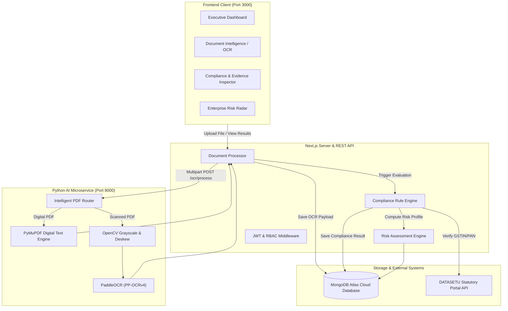

<div align="center">

# BIDSETU — AI-Powered Bid Compliance & Risk Intelligence Platform

[](https://nextjs.org/)
[](https://reactjs.org/)
[](https://python.org/)
[](https://fastapi.tiangolo.com/)
[](https://github.com/PaddlePaddle/PaddleOCR)
[](https://www.mongodb.com/)
[](https://www.typescriptlang.org/)

**Automated Procurement Verification | OCR Document Intelligence | Risk Radar | Statutory Portal Integration**

</div>

---

## 📌 Executive Summary

**BIDSETU** is an enterprise-grade full-stack platform designed to automate bid compliance verification, detect procurement fraud, and extract optical evidence from complex public and private sector tender submissions.

Built specifically to solve high-volume, document-heavy evaluation challenges (e.g. GeM procurement under SIH26100), the platform pairs a modern **Next.js 14 App Router** web interface with a high-throughput **Python FastAPI AI Microservice** running **PaddleOCR (PP-OCRv4)**, **PyMuPDF**, and **OpenCV**.

---

## 🚀 Key Features

* **📄 Optical Document Intelligence**: Multi-page PDF text parsing and optical OCR layout analysis with bounding box `[x1, y1, x2, y2]` visual traceability and word-level confidence scoring.
* **⚡ Intelligent 2-Stage PDF Router**: Automatically routes searchable digital PDFs to PyMuPDF for sub-second extraction while dispatching scanned documents to OpenCV & PaddleOCR.
* **🔍 Automated Compliance Engine**: Evaluates financial thresholds (e.g., turnover limits), technical specs, and statutory requirements against tender clauses.
* **🏛️ Statutory Verification (DATASETU)**: Performs real-time statutory checks (GSTIN validity, PAN verification, and corporate registry validation).
* **🧠 NLI & Contradiction Detection**: Natural Language Inference analysis (`DeBERTa-v3-nli`) to detect contradictions in experience certificates and technical statements.
* **🛡️ Enterprise Risk Radar**: Detects vendor collusion, debarment registry matches, turnover anomalies, and document SHA-256 tampering.
* **📜 Security Audit Trail**: Immutable logging of all document processing, officer overrides, and evaluation decisions.

---

## 🏗️ System Architecture



---

## 🛠️ Repository Structure

```
.
├── ai-service/             # Python FastAPI PaddleOCR AI Microservice
│   ├── app/                # FastAPI application, routers, schemas, services
│   ├── Dockerfile          # Multi-stage container definition
│   ├── README.md           # Microservice documentation
│   └── requirements.txt    # Python dependencies
├── bidsetu-ocr-vps/        # Alternative VPS deployment package for OCR engine
├── docs/                   # Platform Documentation
│   ├── API.md              # REST API endpoint reference & schemas
│   ├── ARCHITECTURE.md     # Deep-dive architecture, data models & pipelines
│   └── DEMO_GUIDE.md       # 20-step live demonstration and evaluation guide
├── public/                 # Static web assets & sample tender documents
├── scripts/                # Utility scripts for synthetic data & PDF generation
├── src/                    # Next.js 14 Web Application
│   ├── app/                # App Router pages and API routes (/api/*)
│   ├── components/         # React UI layout, navigation & data components
│   ├── lib/                # Database models, auth logic, compliance engine
│   └── types/              # TypeScript global interface definitions
├── tests/                  # Node.js automated test suite
├── .env.example            # Environment variable template
├── .gitignore              # Git ignore configuration
├── next.config.js          # Next.js framework configuration
├── package.json            # Node.js dependencies and scripts
├── render.yaml             # Render cloud platform deployment specification
└── tsconfig.json           # TypeScript configuration
```

---

## ⚡ Quick Start & Installation

### Prerequisites
* **Node.js**: v18.x or later
* **Python**: v3.11.x
* **MongoDB**: MongoDB Atlas cluster or local instance

### 1. Environment Setup

Create `.env.local` in the root directory (refer to `.env.example`):

```ini
# MongoDB Connection
MONGODB_URI=mongodb+srv://<user>:<password>@cluster0.mongodb.net/?appName=Cluster0
MONGODB_DB_NAME=bidsetu

# Next.js Application Setup
NEXT_PUBLIC_APP_URL=http://localhost:3000
AUTH_SECRET=bidsetu-secure-secret-key-2026-onebuilds

# Python AI Microservice Endpoint
OCR_SERVICE_URL=http://localhost:8000
OCR_TIMEOUT_SECONDS=60
```

### 2. Start Python AI Microservice

```bash
cd ai-service
python -m venv venv
# On Windows: venv\Scripts\activate | On Linux/macOS: source venv/bin/activate
pip install -r requirements.txt
python -m uvicorn app.main:app --host 0.0.0.0 --port 8000
```

*Verify AI Service Health*: `http://localhost:8000/health`

### 3. Start Next.js Web Application

In the main repository root:

```bash
npm install
npm run dev
```

*Access Web Application*: `http://localhost:3000`

---

## 🧪 Testing

Run the automated test suite verifying password hashing, JWT security, SHA-256 checksums, status state machines, RBAC policies, and category scoring engines:

```bash
npm test
```

---

## 📑 API & Documentation Links

* 📘 [Architecture Documentation](docs/ARCHITECTURE.md)
* 📗 [API Specification](docs/API.md)
* 📙 [20-Step Live Demo Guide](docs/DEMO_GUIDE.md)

---

## ☁️ Deployment

* **Render Deployment**: Pre-configured via [`render.yaml`](file:///C:/Users/Prayag%20Kaushik/Documents/GitHub/Bidsetu/render.yaml).
* **Docker Deployment**: Run `docker-compose up --build -d` inside `ai-service` or `bidsetu-ocr-vps`.

---

## 📄 License

Owned and developed by **OneBuilds Development Team** (SIH26100). Powered by AI-Driven Procurement Compliance & Risk Intelligence.
