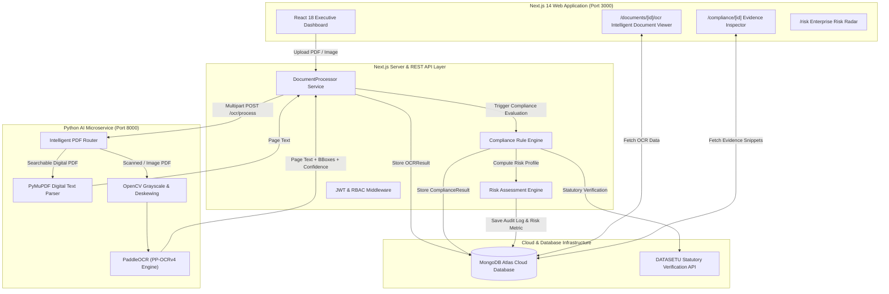

# BIDSETU — Platform Architecture & Technical Documentation

> **SIH Problem Statement**: SIH26100 — AI-Powered Integrated Bid Compliance Verification & Risk Intelligence Platform  
> **Status**: Production-Ready Full-Stack Microservices Architecture

---

## 1. System Overview

**BIDSETU** is an enterprise-grade AI platform built to automate bid compliance verification, detect procurement fraud and risk anomalies, and extract granular optical evidence from complex public and private sector tender submissions.

The platform integrates:
1. **Next.js 14 App Router (Web App & Core REST APIs)**: High-performance React 18 server and client components, server actions, REST API endpoints, JWT authentication with HTTP-only cookies, and MongoDB Atlas data access.
2. **Python FastAPI AI Microservice**: PaddleOCR (v2.7.3 / PP-OCRv4), PyMuPDF text parsing, and OpenCV computer vision pipeline for page layout analysis, bounding box extraction, and confidence scoring.
3. **Statutory Verification Engine (DATASETU)**: Automated external statutory verification for GSTIN, PAN, and corporate records.

---

## 2. System Architecture & Flow



---

## 3. Technology Stack

| Layer | Technology | Specification / Version |
| :--- | :--- | :--- |
| **Web Framework** | Next.js | 14.2.18 (App Router, Server Actions, API Routes) |
| **UI & Styling** | React 18 / TailwindCSS | Lucide React Icons, Clsx, Tailwind Merge |
| **Authentication** | Custom JWT & RBAC | HTTP-only Cookies, Bearer Tokens, `bcryptjs` (salt factor 10) |
| **Database** | MongoDB Atlas / Mongoose | Mongoose 8.x ODM with Schema Validation |
| **AI Microservice** | Python FastAPI / Uvicorn | Python 3.11, Pydantic v2, FastAPI 0.110+ |
| **OCR & CV Engine** | PaddleOCR / PyMuPDF | PaddleOCR 2.7.3 (`PP-OCRv4`), PyMuPDF 1.24 (`fitz`), OpenCV 4.9 |
| **Testing** | Node.js Test Suite | `tests/run-tests.js` (Auth, SHA-256, State Machine, RBAC, Scoring) |

---

## 4. OCR & PDF Intelligent Processing Pipeline

To optimize execution speed and resource consumption, BIDSETU implements a two-stage document router:

```
                            Uploaded PDF Document
                                      |
                                      v
                         File Format & SHA-256 Checksum
                                      |
                                      v
                        PyMuPDF Text Density Assessment
                                      |
             +------------------------+------------------------+
             |                                                 |
   Text Density > 0.05                               Text Density <= 0.05
 (Digital Text Stream)                             (Scanned Document / Image)
             |                                                 |
             v                                                 v
    PyMuPDF Text Parser                            OpenCV Preprocessor
(Fast Word/Line Extractor)                     (Denoise, Grayscale, Deskew)
             |                                                 |
             |                                                 v
             |                                        PaddleOCR Engine
             |                                    (Deep Optical Detection)
             |                                                 |
             +------------------------+------------------------+
                                      |
                                      v
                         Normalized OCR JSON Payload
                [Pages | Text | Bounding Boxes | Confidence]
```

---

## 5. Database Schema Specifications

The MongoDB layer uses six primary collections defined via Mongoose models:

### 1. `DocumentModel` (`documents` collection)
- `_id`: String (Primary Key)
- `fileName`: String
- `fileSize`: Number (in bytes)
- `mimeType`: String (`application/pdf`, `image/png`, `image/jpeg`)
- `sha256`: String (Immutable SHA-256 hash of original file buffer)
- `fileData`: String (Base64 file representation)
- `status`: String (`UPLOADED` \| `PROCESSING` \| `PROCESSED` \| `FAILED`)
- `createdAt`: Date

### 2. `OCRResultModel` (`ocrresults` collection)
- `_id`: String (`ocr-docId`)
- `documentId`: String (Foreign Key -> `documents._id`)
- `documentName`: String
- `ocrVersion`: String (`PaddleOCR` or `PyMuPDF / TextParser`)
- `overallConfidence`: Number (0.0 to 1.0)
- `pagesProcessed`: Number
- `pages`: Array of `OCRPage` objects (`pageNumber`, `text`, `confidence`, `blocks`: `[{text, confidence, bbox: [x1, y1, x2, y2]}]`)
- `structuredFields`: Array of Extracted Field objects (`key`, `label`, `category`, `value`, `confidence`)
- `rawText`: String

### 3. `ComplianceResultModel` (`complianceresults` collection)
- `_id`: String (`comp-bidId`)
- `bidId`: String
- `tenderId`: String
- `overallScore`: Number (0 - 100)
- `verdict`: String (`COMPLIANT` \| `NON_COMPLIANT` \| `HIGH_RISK`)
- `clauseEvaluations`: Array of evaluated requirements with evidence pointers and status.
- `evaluatedAt`: Date

### 4. `AuditLogModel` (`auditlogs` collection)
- `_id`: String (`aud-timestamp`)
- `actorUserId`: String
- `actorName`: String
- `actorRole`: String (`ADMIN` \| `PROCUREMENT_OFFICER` \| `VENDOR` \| `SYSTEM`)
- `action`: String (`DOCUMENT_PROCESSED`, `COMPLIANCE_EVALUATED`, `BID_SUBMITTED`, etc.)
- `resourceType`: String
- `resourceId`: String
- `result`: String (`SUCCESS` \| `FAILED`)
- `timestamp`: Date

---

## 6. Security Architecture

1. **Authentication & Session Security**:
   - Passwords hashed using `bcryptjs` with salt factor 10.
   - Stateless JWT tokens passed via secure HTTP-only cookies and Bearer headers.
2. **Role-Based Access Control (RBAC)**:
   - Enforced across three roles: `ADMIN`, `PROCUREMENT_OFFICER`, and `VENDOR`.
   - IDOR prevention logic ensures vendors can only access documents owned by their organization.
3. **Document Integrity & Anti-Tampering**:
   - SHA-256 hashing calculated at upload time to guarantee document immutability and detect duplicate submissions.
